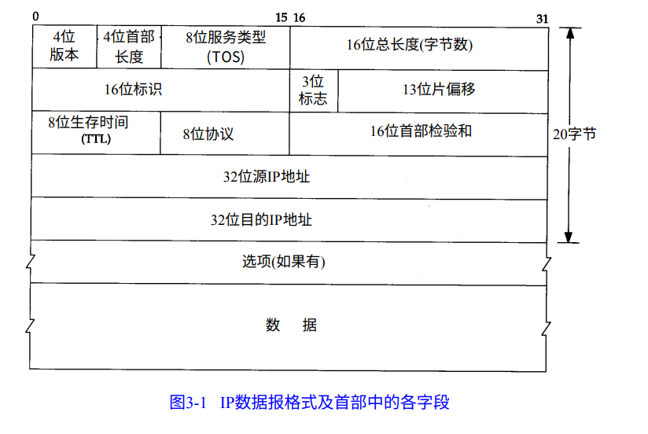
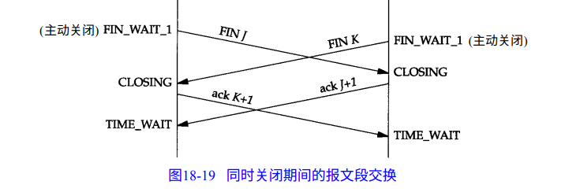
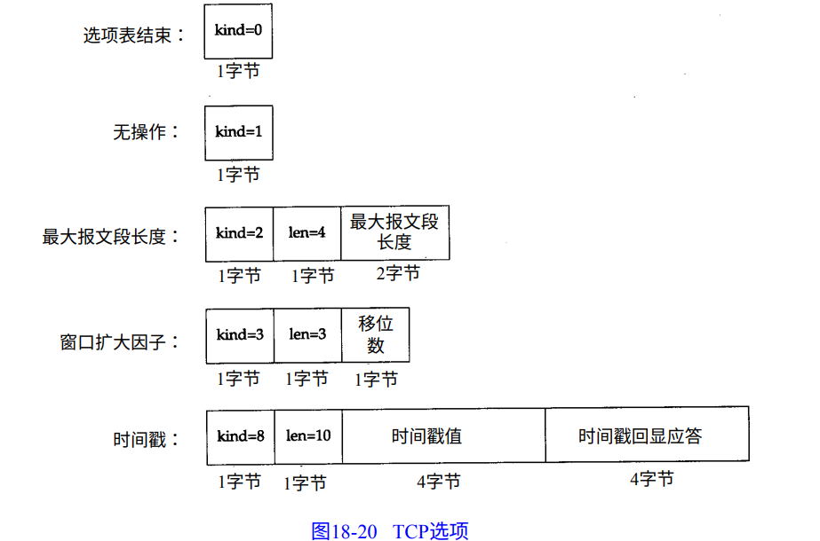

计算机网络

# IP



> **协议**：1（ICMP）、2（IGMP）、6（TCP）、17（UDP）
>
> **标识字段**：唯一的标识主机发送的每一份数据报。
>
> **标志字段**：
>
> **片偏移**：

# TCP

TCP提供**面向连接**的、**可靠**的**字节流**服务。*（TCP不在字节流中插入记录标识）*

**可靠性**保证：

- 应用数据被TCP分割成最适合发送的数据块。（UDP不分块）
- TCP发出一个段后，它启动一个定时器，如果不能及时收到确认，将重发这个报文段。（自定义的超时及重传）
- TCP收到来自另一端的数据将推迟几分之一秒，发送一个确认。
- TCP会对收到的数据进行重新排序，将收到的数据以正确的顺序交给应用层。
- 流量控制。只允许另一端发送接收端缓冲区所接纳的数据。

## 首部


**序号**：32位无符号数，表示在这个报文段中第一个数据字节，到达2^32-1后双从0开始。（**SYN**与**FIN**均消耗序号）

**首部长度**：单位为32位即4字节，取值是0－15，所以TCP最多有60字节的首部，正常的长度是20字节。

**窗口大小**：单位为字节数。起始于确认序号字段指明的值

**检验和**：覆盖整个TCP报文段：TCP首部和TCP数据。（与UDP类似，需加伪首部）

**紧急指针**：正的偏移量，和序号字段中的值相加表示紧急数据最后一个字节的序号。

**可选字段**：最长报文大小（MSS）、窗口扩大选项、时间戳选项

数据部分是可选的。

## 连接的建立与终止

### 连接建立的超时

当第一个SYN没有收到回复时，重试6次，等待时间分别为1，2，4，8，16，32，64。

### FIN_WAIT_2状态

### 复位报文段

`RST`

### 同时打开

TCP中同时打开只会建立一条连接（注意，在其他协议族，如OSI运输层会建立两条连接）

### 同时关闭




### MSS选项

MSS(Maximum Segment Size)最大报文长度

**只能出现在`SYN`报文中**

当TCP发送SYN时，将MSS值设置为外出接口上的MTU长度减去固定IP首部和TCP首部长度。

通常以太网上为1460。使用IEEE 802.3的封闭，MSS可达1452字节。

### 2MSL

MSL报文段最大生存时间

Linux 4.15 实现为 60s

**在2MSL等待期间，本地端口默认不能再被使用，部分系统中设置`SO_REUSEADDR`可重用**

客户端主动关闭会进入**TIME_WAIT**

### 呼入连接请求队列

该队列中的连接已被TCP接受（即三次握手已经完成），但还没有被应用层所接受。

应用层指明该队列的最大长度，这个值通常称为积压值（**backlog**）。

当队列已满时，TCP不理会传入的SYN，也不发回RST作为应答。由于不应答SYN，服务器程序迫使客户端随后重传SYN，以等待连接队列有空间接受新的连接。


## 交互数据流

两类数据：成块数据（90％）和交互数据（10％）

### 经受时延的确认

TCP收到数据的时候不立即发关ACK，相返，它推迟发送，以便ACK与需要沿该方向的数据一起发送。（数据捎带ACK）

### Nagle算法

通常使用Nagle算法来减少小报文的数目，这个算法限制发送者任何时候只有一个发送的小报文未被确认。

## 成块数据流

### 窗口大小

接收方窗口控制

- 接收方通告窗口(awnd)

发送方窗口控制

- 滑动窗口(swnd)
- 拥塞窗口(cwnd)
- swnd = min(awnd, cwnd)

### PUSH标志位

发送方通知接收方TCP将所收到的数据全部提交给接收进程。


## 超时与重传

对于每个连接TCP管理4个不同的定时器：

- 重传定时器：
- 坚持(persist)定时器
- 保活(keepalive)定时器
- 2MSL定时器

### RTO

RTO(Retransmission Timeout)，即重传超时时间

### RTT

Round-Trip Time 往返时间


## 分片

IP层根据MTU对数据进行分片，在发送端分片，接收端合并。一个被IP层分片的TCP报文中只要有一个分片丢失了，整个TCP报文都得发。

UDP不分片

TCP分片

**总结：IP层会根据MTU对上层的数据进行分片，TCP中可以根据MSS的大小在传输层进行分片，从面避免在IP层进行分片，而UDP不分片，因此当数据过大时，往往会在IP层分片。**

示例：

TCP分片 curl http://www.baidu.com

IP分片 UDP 发送大量数据 （设置禁止分片）

## ss中5种类型的timer

> - on: means one of these timers: tcp retrans timer, tcp early retrans timer and tail loss probe timer
> - keepalive: tcp keep alive timer
> - timewait: timewait stage timer
> - persist: zero window probe timer
> - unknown: none of the above timers
>


## 不同进程监听不同网卡的同一端口（同一端口不同协议、同一协议不同网卡）

```base
# tcp
nc -l 8888
nc -l -s 127.0.0.1 -p8888

#udp
nc -lu 8888
nc -lu -s 127.0.0.1 -p8888
```

**注意Linux 3.9之后，增加了`SO_REUSEPORT`，（具体可man 7 socket）多个进程可以监听同一网卡同一协议的同一端口**


## TCP 选项



**最长报文大小**

- **通常是为了避免分段**。

**窗口扩大选项**

- 只能出现在SYN报文段中，因此当连接建立起来后，在每个方向的扩大因子是固定的。
- 每个方向的扩大因子可以不同。

**时间戳选项**

- 发送方在每个报文段中放置一个时间戳值，接收方在确认中返回这个数值，从而允许发送方为每一个收到的ACK计算RTT。

## Recv-Q vs Send-Q

> **Recv-Q**
>
> Established: The count of bytes not copied by the user program connected to this socket.
>
> Listening: Since Kernel 2.6.18 this column contains the current syn backlog.
>
> **Send-Q**
>
> Established: The count of bytes not acknowledged by the remote host.
>
> Listening: Since Kernel 2.6.18 this column contains the maximum size of the syn backlog.

## TCP常用参数

tcp_retries1

tcp_retries2

tcp_mem

tcp_rmem

tcp_wmem

tcp_defer_accept

> 允许一个监听唤醒只当socket有数据到达的时候。采用一个整形值为参数（s），它可以与TCP为了完成连接所尝试的最大次数结合。这个选项不应在可移植的代码中使用。*(一定程度上可以限制全连接攻击)*

tcp_cork

> 如果启用，不发送部分帧。再次清除该选项时会发送所有排队的帧。这主要用于在调用**sendfile(2)**前prepending头部，还有流量优化。在当前的实现中，有一个200毫秒的上限，如果上限到达了，所有的排队的数据将自动传输。从Linux 2.5.71开始，这个选项可以和**TCP_NODELAY**组合使用。
>
> 这个选项不应用于可移植的代码中。*(cork:软木塞)*

tcp_nodelay

> 如果启用，表示禁用Nagle算法。这意味着报文将尽可能快的被发出去，甚至只有小量数据。如果没有启用，数据将被缓存到足够多才发送，这样可以避免频繁的发送小包的数据，从而提高网络的利用率。这个选项会被**TCP_CORK**覆盖；然而即使启用了**TCP_CORK**，启用这个选项仍然会强制显式刷新待发送的数据。

*man tcp(7)*

```c
// man listen(2)
int listen(int sockfd, int backlog);
```

> 从`Linux`2.2开始，`backlog`参数指定的是已完成的待`accepted`队列长度，而不是未完成的连接请求。未完成的最大连接请求可以通过`/proc/sys/net/ipv4/tcp_max_syn_backlog`设置，当启用了`syncookies`，在逻辑上没有最大长度，这个设置会被忽略掉。如果`backlog`参数比`/proc/sys/net/core/somaxconn`大，它将默默的截断为该值。

Listen队列

net.ipv4.tcp_max_syn_backlog = 256 （最大的未完成的连接请求队列）

net.core.somaxconn = 128 （已完成的连接请求队列，待`accept`队列）

网卡接收队列

net.core.netdev_max_backlog = 1000

网卡发送队列

default qlen 1000 (ip addr)


## 时延

**发送时延**

> 发送时延是主机或路由器发送数据帧所需要的时间，也就是从发送数据的第一个比特算起，到该帧的最后一个比特发送完毕所需的时间。发送时延也称为**传输时延**。
>
> 发送时延 = 数据帧长度（b） / 信道带宽（b/s）

**传播时延**

> 传播时延是电磁波在信道中传播一定的距离需要花费的时间。
>
> 传播时延 = 信道长度（m） / 电磁波在信道上的传播速率（m/s） （电磁波在信道上的传播速率接近光速）


普通路由器只修改MAC地址，带NAT功能的会修改IP地址，带NAPT功能的才会修改端口地址。

# 网卡

网卡NIC(Network Interface Card)

> 包含OSI模型中两个层的物理层和数据链路层
>
> - 物理层定义了数据传送与接收所需要的电与光信号、线路状态、时钟基准、数据编码和电路等，并向数据链路层设备提供标准接口
> - 数据链路层则提供寻址机构、数据帧的构建、数据差错检查、传送控制、向网络层提供标准的数据接口等功能。

10M以太网使用曼切斯特码，100M以太网使用差分曼切斯特码

[Linux的网络协议中的网卡缓冲区](https://blog.csdn.net/Just_Do_IT_Ye/article/details/47000383)

[网卡究竟工作在OSI的哪一层？](https://www.linuxidc.com/Linux/2012-12/77132.htm)

[https://wenku.baidu.com/view/b33f12746edb6f1aff001f76.html?from=search](https://wenku.baidu.com/view/b33f12746edb6f1aff001f76.html?from=search)

[https://wenku.baidu.com/view/5bc552808762caaedd33d451.html?from=search](https://wenku.baidu.com/view/5bc552808762caaedd33d451.html?from=search)


